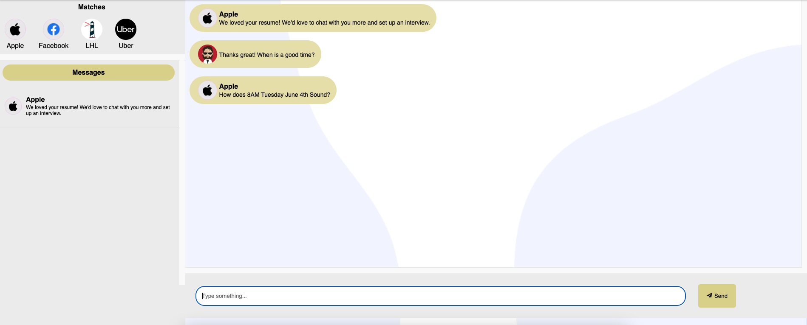
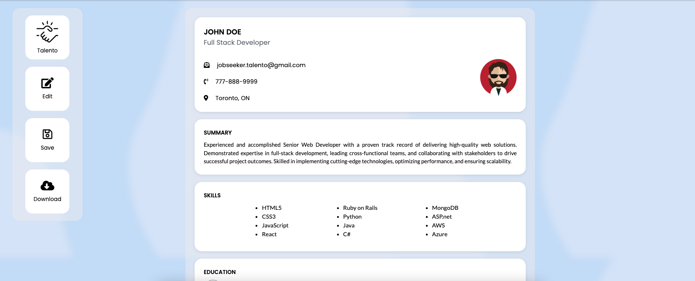

# 🚀 Talento

Talento is a revolutionary job search platform that leverages the swipe mechanic from popular dating apps to streamline the job hunting process for both employers and job seekers.

## 📌 Features

- **Message Feature**: Communicate directly with potential employers or job seekers.
- **Login Feature**: Secure authentication through Auth0.
- **MyResume Section**: Showcase your work experience and skills.
- **Match and Swipe Feature**: Explore job opportunities or potential candidates with a simple swipe.

## 🔧 Technologies Used

- React
- NodeJS
- Express
- PostgreSQL

## 💻 Getting Started

Here are the instructions to get the platform up and running on your local machine for development and testing purposes.

### Prerequisites

You need to have NodeJS and npm installed on your local development machine. If not, you can install it [here](https://nodejs.org/en/download/).

To setup the database, follow the instructions below:

1. Install PostgreSQL on your machine if you haven't. You can find the download link and instructions [here](https://www.postgresql.org/download/).

2. Create a new PostgreSQL database. The following environment variables need to be set:

.env.example:
PGHOST=
PGUSER=
PGDATABASE=
PGPASSWORD=
PGPORT=

.env.development:
PGHOST=localhost
PGUSER=talentodev
PGDATABASE=talento_development
PGPASSWORD=talentodev
PGPORT=5432

### Installation

To install the necessary packages, follow these steps:

1. Clone the repo.
2. Open a terminal in the `client` directory and run `npm install`.
3. Repeat step 2 in the `server` directory.

## 👨‍💻 Creators

- **Creator 1**: Diogo Ramos - Diogo.ramos@me.com - https://www.linkedin.com/in/diogomiguelramos/
- **Creator 2**: Rui Dantas - Ruidantas55@gmail.com - https://www.linkedin.com/in/rui-dantas-043078248/?originalSubdomain=ca
- **Creator 3**: Jerome Lagbas - jeromelagbas@gmail.com - https://www.linkedin.com/in/jeromealmir/?trk=public_profile_browsemap&originalSubdomain=ca

## 📞 Contact

Project Link: [https://github.com/Ruheee/Talento](https://github.com/Ruheee/Talento)